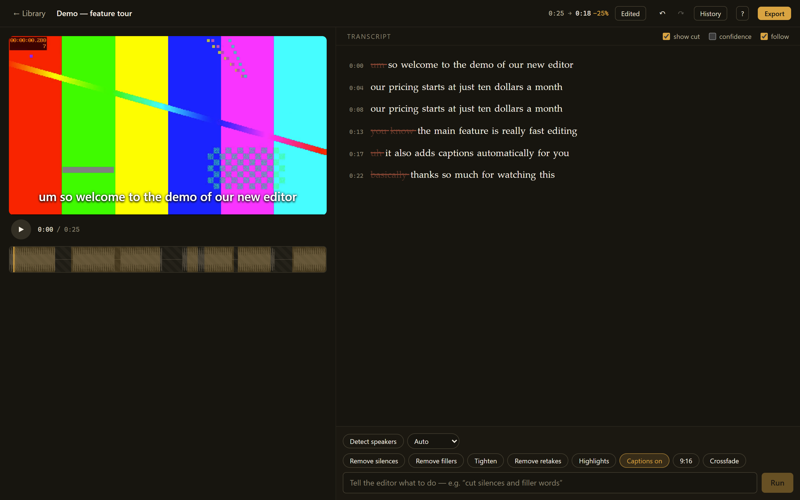
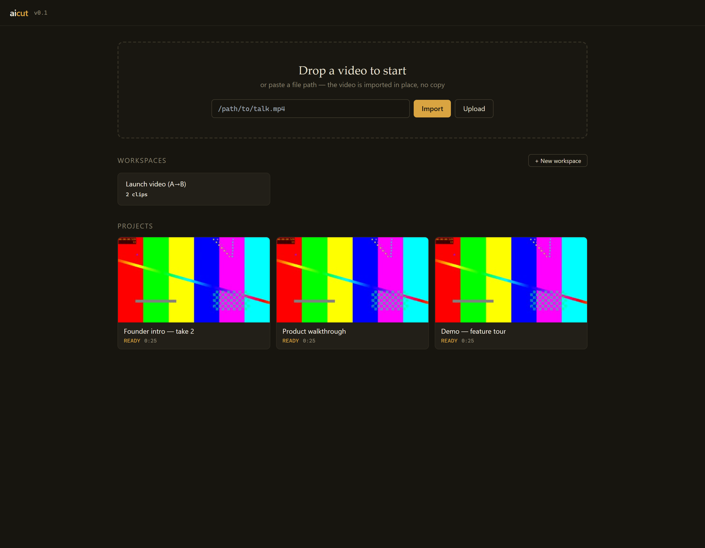
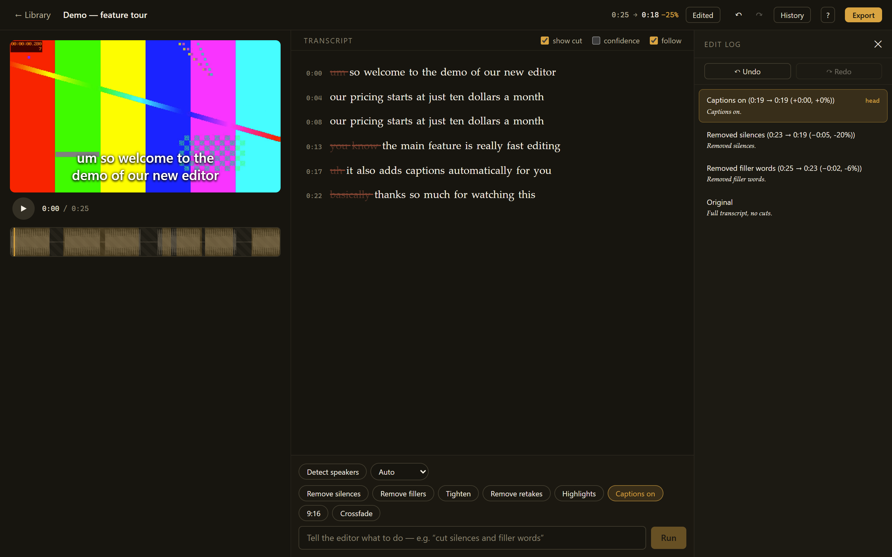
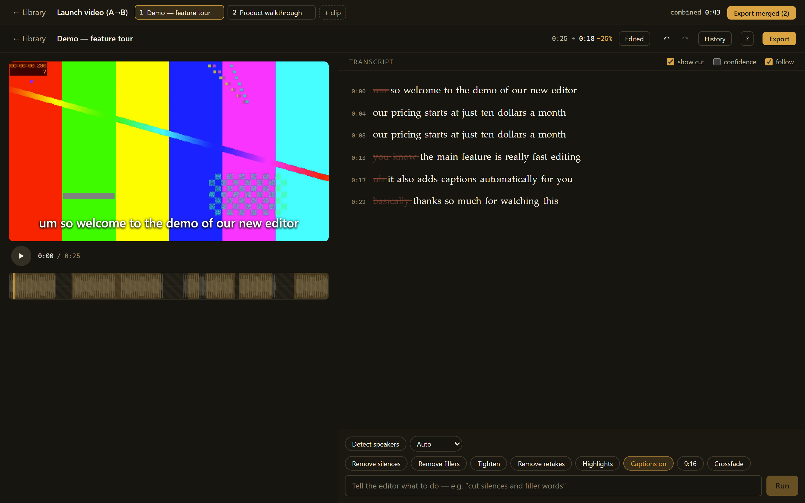
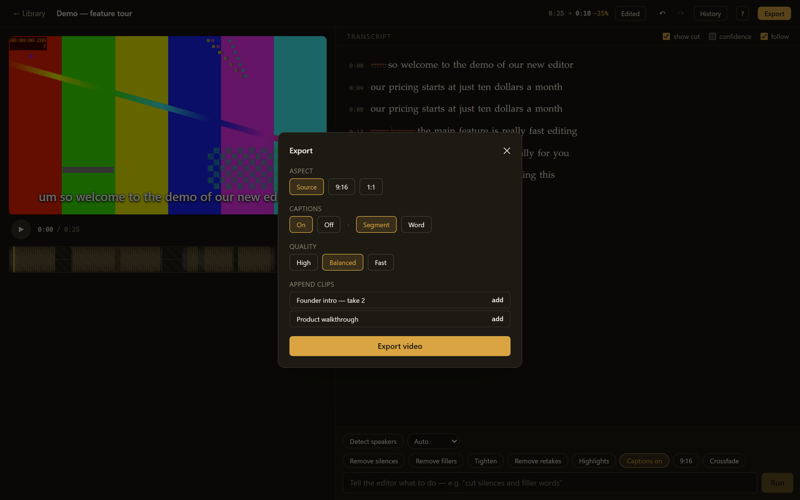

# aicut — an AI-controlled video editor

`aicut` is a local, desktop-class video **editor** that treats the transcript as
the timeline. You cut by editing words or by telling the editor what you want in
plain language — and every edit previews instantly, with no re-render.

<p align="center">
  
</p>

There are two ways to drive it, and they share one engine:

1. **By talking to it.** An AI command bar: *"cut all the silences and filler
   words"*, *"keep only the parts where I talk about pricing"*, *"trim
   everything before the demo starts"*, *"add captions and make it vertical"*.
2. **By editing the transcript.** Descript-style: select words, hit Delete →
   those moments are cut. Click a word → the player seeks there. Cut words stay
   on screen as struck-through redactions so nothing is ever lost.

The core design rule: **the LLM never invents timestamps.** It emits a typed
`EditPlan` (JSON actions that reference transcript segment/word ids); a
deterministic compiler resolves actions → keep-ranges, validating and clamping
everything against the real transcript. Manual UI edits compile to the *same*
range operations. One engine, two input methods.

```
┌──────────────────────────── frontend (React) ───────────────────────────┐
│  player (skip-preview, caption overlay)  │  interactive transcript      │
│  timeline strip (kept/cut, playhead)     │  AI command bar + edit log   │
└───────────────┬─────────────────────────────────────────────────────────┘
                │ REST + SSE                       │ <video src> (HTTP Range)
┌───────────────▼─────────────── backend (FastAPI) ───────────────────────┐
│ projects · transcription (faster-whisper, GPU) · embeddings · LLM plans │
│ EDL compiler & range math · ffmpeg export (NVENC) · media serving       │
└─────────────────────────────────────────────────────────────────────────┘
```

## Quick start

```bash
# 0. Check your environment (never crashes; degrades gracefully)
uv run python -m aicut doctor

# 1. Install deps
uv sync                 # engine + API + tests (light)
uv sync --extra ml      # + faster-whisper + sentence-transformers (heavy, GPU)
cd frontend && npm install && cd ..

# 2. Run everything (backend reload + Vite dev server)
python scripts/dev.py         # or: make dev

# 3. Open http://localhost:5173
```

Drop a video (or paste a path — it's imported in place, no copy) and aicut
transcribes it in the background, streaming progress live. Projects and
multi-clip workspaces live in a simple library.

<p align="center">
  
</p>

For the AI command bar, install [Ollama](https://ollama.com) and pull a model:

```bash
ollama pull qwen2.5:7b-instruct     # default planner
# ollama pull qwen2.5:14b-instruct  # stronger; fits 12 GB VRAM (whisper is freed after transcription)
```

**The app is fully usable without Ollama** — manual transcript editing and the
one-click *Remove silences / Remove fillers / Tighten / Remove retakes /
Highlights / Captions / 9:16* actions are deterministic and never touch the LLM.
(Retake detection and the Highlights auto-short are heuristic, so they need no
ML deps either.)

## How it works

- **Transcription** — `faster-whisper` `large-v3` with word timestamps and VAD.
  Multilingual (English / Hindi / Hinglish). Runs on GPU (`int8_float16`) with a
  clean CPU fallback; the model is freed from VRAM after each job so the LLM
  fits.
- **Engine** — a pure, dependency-light core: [`rangemath.py`](backend/aicut/rangemath.py)
  (merge/subtract/intersect/invert/pad + `remap_time`), the
  [EDL compiler](backend/aicut/edl.py) (actions → keep-ranges), and the
  [revision model](backend/aicut/project.py) (undo = moving a head pointer).
- **Preview without rendering** — the original file stays in `<video>`; a
  `requestAnimationFrame` loop skips over cut regions. Captions and 9:16 are
  cosmetic DOM/CSS previews of what export burns in.

Every edit — AI command, one-click action, or manual deletion — appends a
labelled revision. Undo/redo and the edit log are just a head pointer moving
along that list, so time-travel and state recovery come for free.

<p align="center">
  
</p>

### Editing aids

A cached audio **waveform** under the timeline (ffmpeg peaks → canvas), optional
**confidence shading** of low-probability transcript words, a **Tighten** pass
that caps every pause, and **retake removal** that keeps only the last clean
attempt at a repeated line. Export options are remembered per project.

### Workspaces (multi-clip)

Group two or more clips into one workspace, edit each with the full toolset via
clip tabs, and **export them stitched A→B→…** as a single file (normalized to
one canvas/fps, captions offset per clip). Each clip stays an independent
project; the workspace just orders them.

<p align="center">
  
</p>

### Transitions

Optional **crossfade** or **wipe** between kept ranges (`xfade`+`acrossfade` at
export; hard cut is the default). The overlap is clamped to the shortest segment
and falls back to a hard cut when too tight; captions are re-timed onto the
compressed timeline so they stay in sync.

### Speaker diarization

Label who's talking, then **keep only Speaker 1** (or remove them) as a
deterministic edit. Ships with a dependency-light numpy + ffmpeg clusterer;
`uv sync --extra diarize` swaps in pyannote for accuracy.

### Export

<p align="center">
  
</p>

ffmpeg re-encodes per keep-range (`trim/atrim` + `setpts` + `concat`), with
~15 ms audio fades so cuts don't click, ASS captions rendered on the **output**
timeline, and optional 9:16 crop. `h264_nvenc` when available, else `libx264`.
Progress streams back over SSE.

## Layout

```
backend/aicut/     engine + FastAPI app
  models.py        pydantic contracts (Transcript, Action union, EDL, Project)
  rangemath.py     pure range math (unit-tested to death)
  edl.py           action → keep-range compiler
  project.py       persistence + revision/undo model
  transcribe.py    faster-whisper wrapper (lazy import)
  embeddings.py    sentence-transformers topic resolver (lazy import)
  diarize.py       speaker clustering (numpy fallback + optional pyannote)
  waveform.py      ffmpeg peak extraction + cache
  llm.py           Ollama planning client
  ffmpeg_export.py export renderer (cuts, captions, transitions, 9:16)
  ass_builder.py   caption ASS generator
  app.py           REST + SSE API
frontend/          Vite + React + TS + Tailwind + zustand
tests/             pytest engine/API tests + make_fixture.py
scripts/dev.py     one-command dev runner
scripts/demo_seed.py  seed a self-contained demo project (no video needed)
```

## Development

```bash
make dev      # backend (reload) + frontend (Vite)
make check    # ruff + pytest + tsc --noEmit
make test     # pytest only
```

The screenshots above are generated from a self-contained demo project — run
`uv run python scripts/demo_seed.py` to create one locally (it synthesizes a
short clip with filler words, silences, and a repeated take, so every one-click
action does something visible without needing your own footage).

See [`DECISIONS.md`](DECISIONS.md) for every judgment call, [`QA.md`](QA.md)
for the manual test script, and [`IDEAS.md`](IDEAS.md) for deferred features.

## Status

Built milestone by milestone; see git history.

**v1 (M0–M6):**

- **M0** scaffold, `doctor`, dev/check tooling
- **M1** engine core — range math + remap, EDL compiler, revision model, transcription
- **M2** REST + SSE API, editor shell, Range media serving
- **M3** manual editing — select/delete/restore, timeline, undo/redo, edit log
- **M4** one-click deterministic actions + LLM command bar (Ollama)
- **M5** captions (ASS export + preview) and 9:16 (export + preview), export dialog
- **M6** design/UX polish, keyboard map, empty/error states, docs

**Beyond v1:** waveform + confidence shading, Tighten and retake removal,
multi-clip workspaces, crossfade/wipe transitions, and speaker diarization —
each behind the same typed-plan → deterministic-compile engine.

## License

MIT
